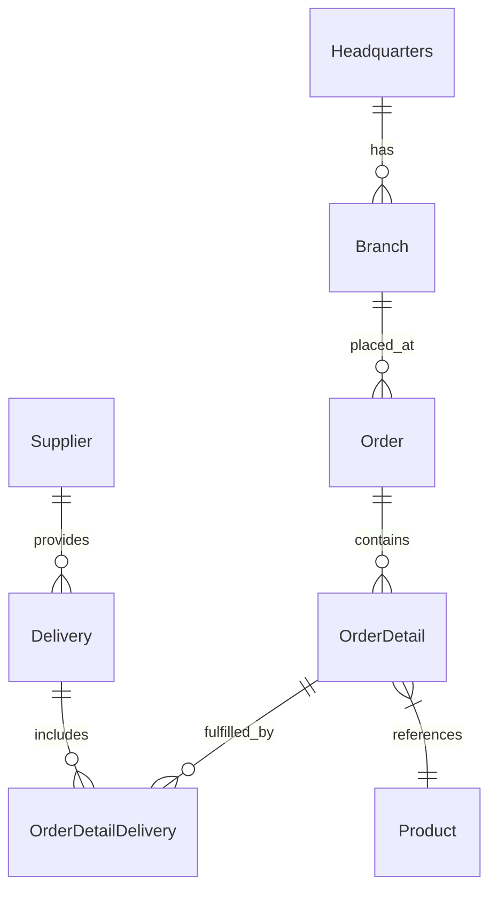
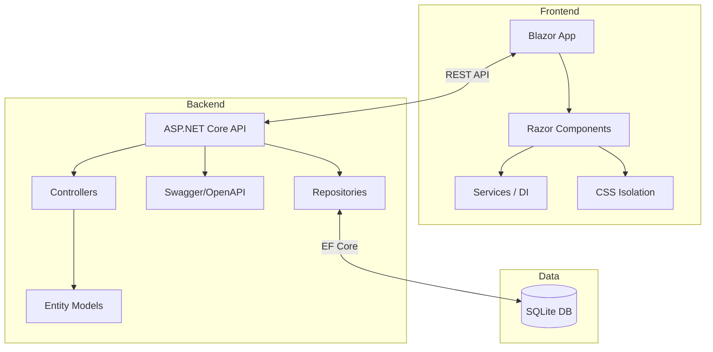

# OctoCAT Supply Chain Management System Architecture

This site is a demo application written in C# with .NET 10. The entire app was created originally from an [ERD diagram](../api/ERD.png) and natural language prompts using Copilot. The frontend was created in the same way, using some of the design ideas in [the design folder](./design/).

The hero image and product images were created by prompting ChatGPT!

## Architecture Overview

The system is a modern supply chain management application built using .NET 10, comprising a backend ASP.NET Core Web API and a Blazor frontend. It's designed to demonstrate Copilot capabilities using a fairly typical architecture with a little complexity, but not enough to derail demos!

### Backend Architecture
- ASP.NET Core Web API with RESTful controller endpoints for all entities
- Entity Framework Core persistence using a repository pattern
- EF Core migrations and seed data managed via code-first approach
- Swagger/OpenAPI documentation integration
- Entity models with proper relationships following an ERD diagram

### Frontend Architecture
- Blazor with .NET 10
- Razor components for UI
- CSS isolation for component styling

### DevOps Integration
- Docker/Docker Compose for containerization
- Optional Bicep + GitHub Actions plan for Azure deployment

## ERD

## Component Architecture

## Key Features

- Complete REST APIs for all supply chain entities
- EF Core-backed persistence with foreign keys and indexed queries
- Code-first migrations and deterministic seed data
- Detailed OpenAPI documentation, generated by Copilot
- Modern Blazor UI with responsive design, generated by Copilot using images
- Containerization for consistent deployment, generated by Copilot

## Persistence and Data Model

- Database: SQLite (file located at `api/data/app.db` by default; configurable via `DB_FILE`)

- Access: thin repository layer that maps camelCase models to snake_case columns

- Migrations: SQL scripts in `api/sql/migrations` executed in order and tracked in a `migrations` table
- Seeding: ordered SQL scripts in `api/sql/seed` to bootstrap demo data
- Test mode: in-memory database (`:memory:`) for fast and isolated tests

See the dedicated guide: `docs/sqlite-integration.md`.
